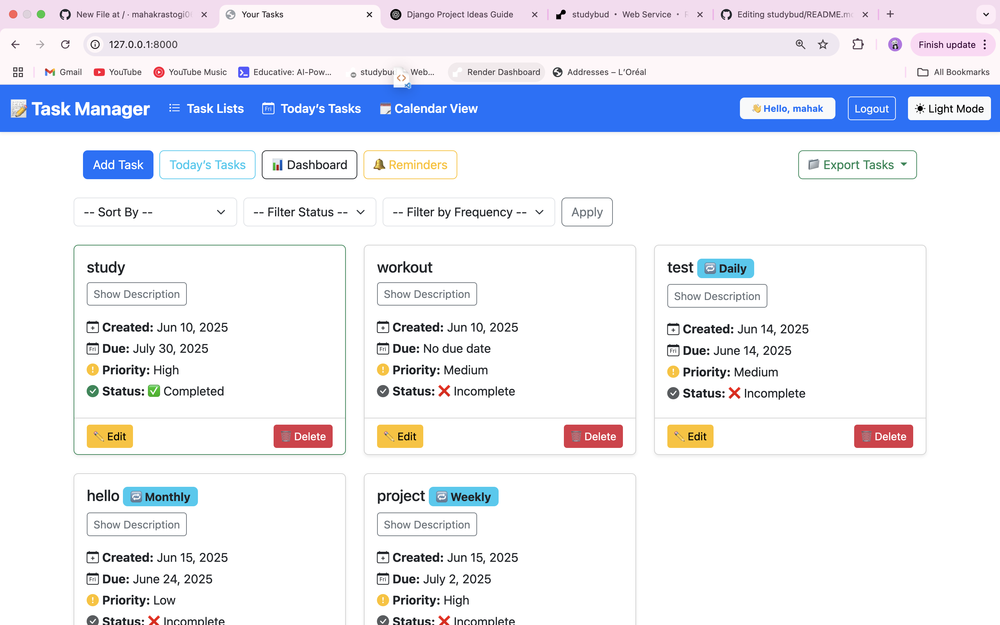
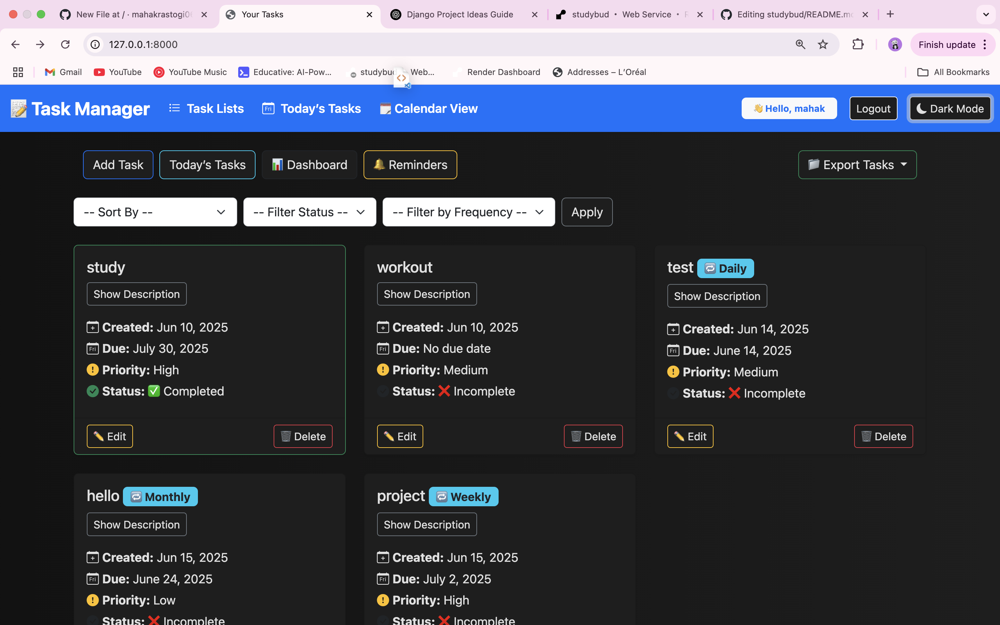
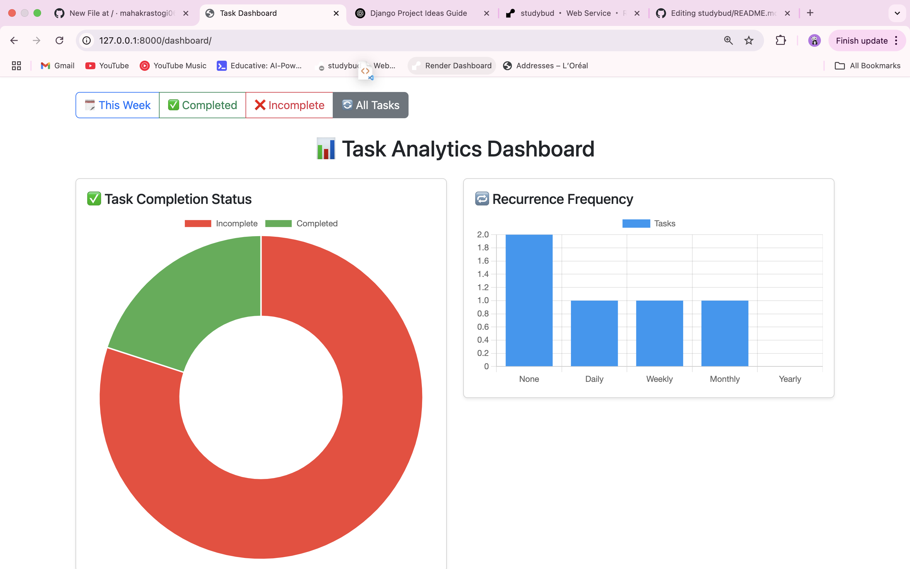
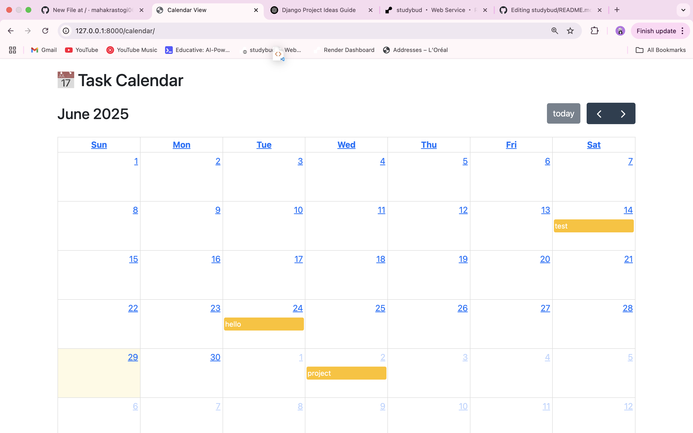

# 📝 Personal Task Manager

A powerful and responsive web-based task manager built with **Django** and **Bootstrap**. It allows users to efficiently manage daily tasks, visualize progress via dashboards, export tasks, and more – all with a clean, modern UI and dark mode toggle!

## 🌟 Features

- ✅ Add, update, delete personal tasks
- 📅 Due date and priority management
- 🔁 Recurring task support (daily, weekly, etc.)
- 📊 Interactive dashboard with charts (status, priority, frequency)
- 🗓 Calendar view using FullCalendar.js
- 📤 Export tasks as CSV or PDF
- 🌙 Light/Dark mode with toggle + persistence
- 🔍 Task sorting and filtering
- 🧾 Responsive UI for all screen sizes

## 🛠 Tech Stack

- **Backend**: Python, Django
- **Frontend**: HTML, CSS, Bootstrap 5, JavaScript
- **Visualization**: Chart.js, FullCalendar.js
- **PDF Export**: ReportLab
- **Database**: SQLite (development)

## 🧑‍💻 Cloning the Repository

--> Clone the repository using the command below:

```bash
git clone https://github.com/mahakrastogi0602/personal-task-manager.git
```  

--> Move into the directory where we have the project files:

```bash
cd personal-task-manager
```

--> Create a virtual environment :

```bash
# Let's install virtualenv first
pip install virtualenv

# Then we create our virtual environment
virtualenv envname
```--> Activate the virtual environment:

```bash
envname\Scripts\activate  # For Windows
# OR
source envname/bin/activate  # For macOS/Linux
```

--> Install the requirements:

```bash
pip install -r requirements.txt
```

🚀 Running the App

--> To run the App, use:

```bash
python manage.py runserver
```
> ⚠️ **Note:** Then, the development server will be started at: http://127.0.0.1:8000/

## 🖼️ App Preview 

### Feed Home Page



### Dark Mode Feed Home Page



### Dashboard Page



### Calender View Page



## 🚀 Live Demo

Check out the live version of the project here:  
🔗 [StudyBud Live on Render](https://studybud-u9sw.onrender.com/)


          
# force redeploy
